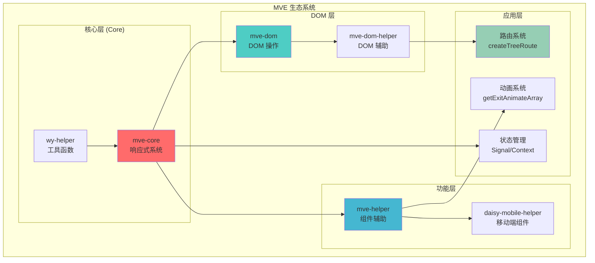
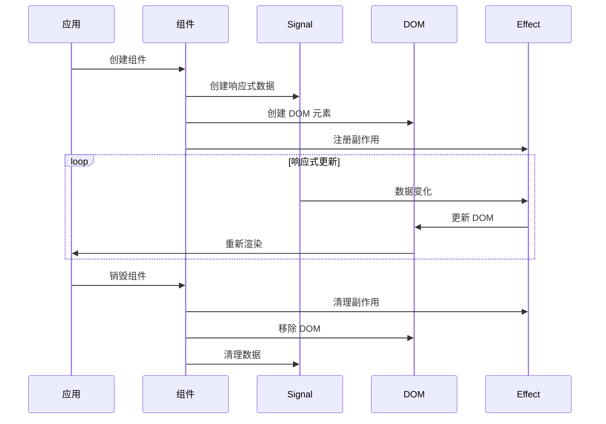
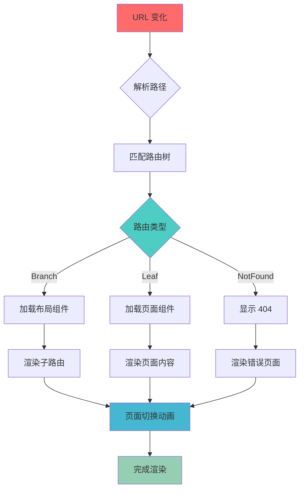
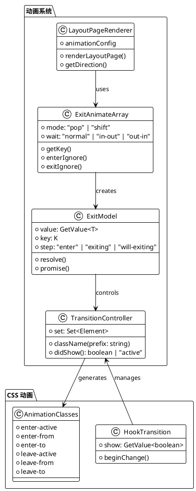
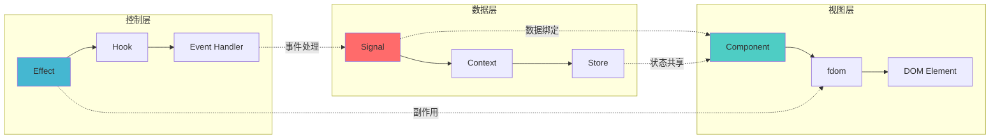
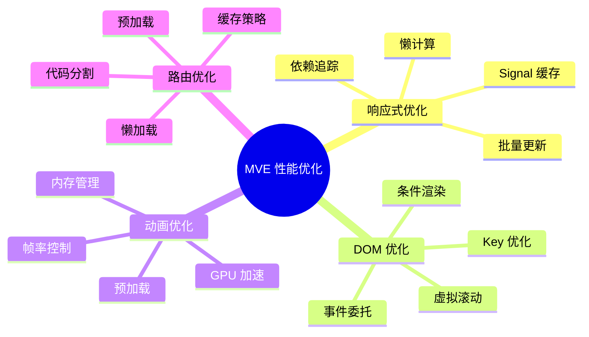
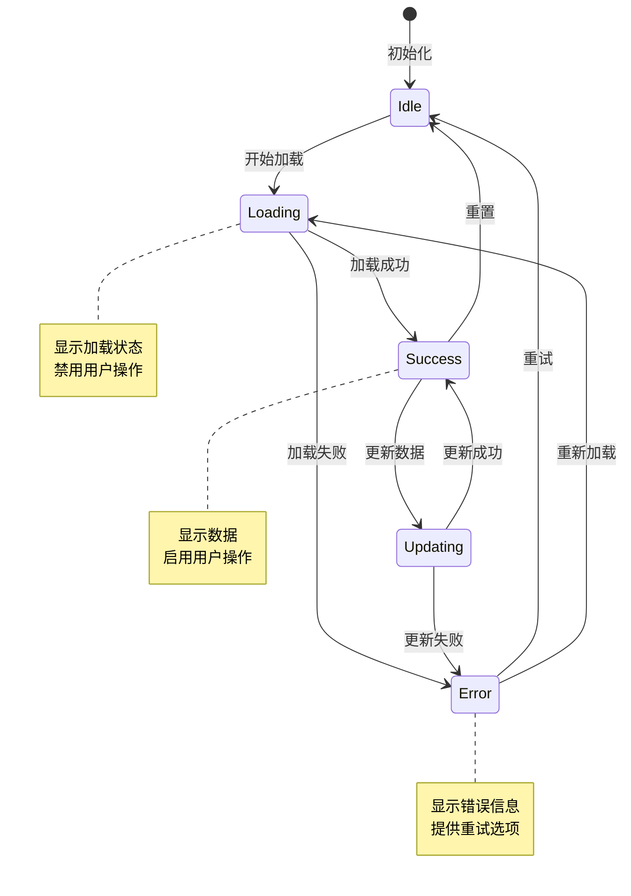
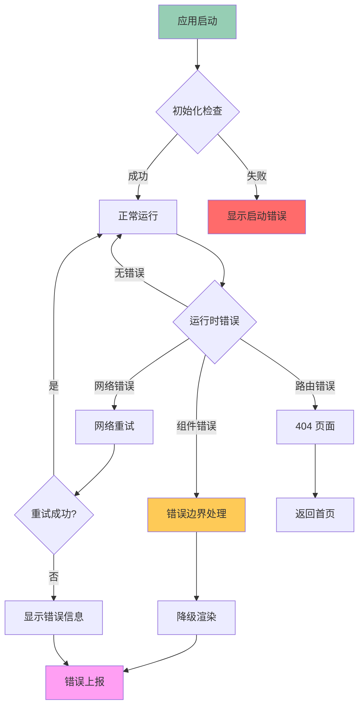
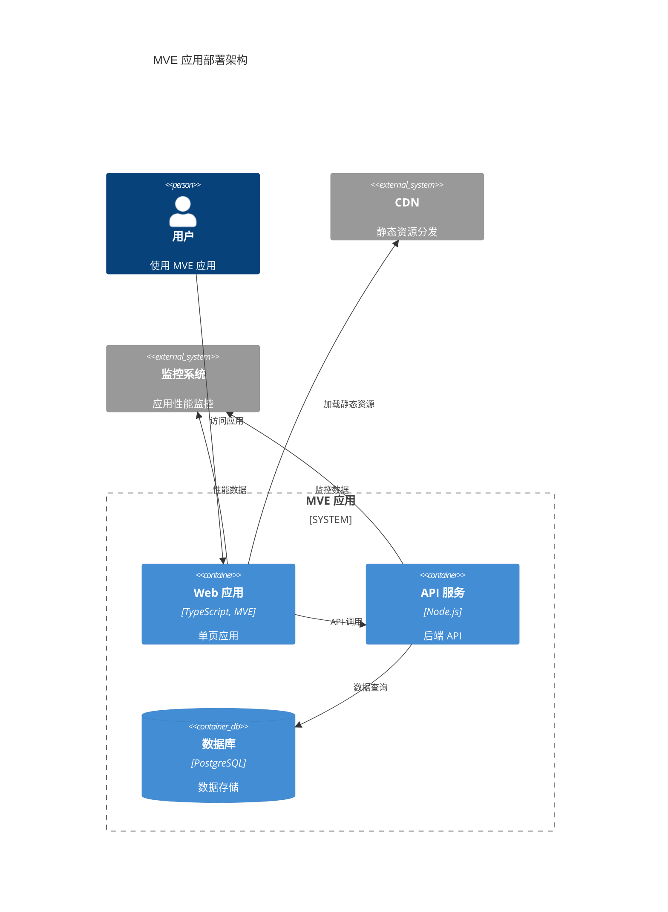
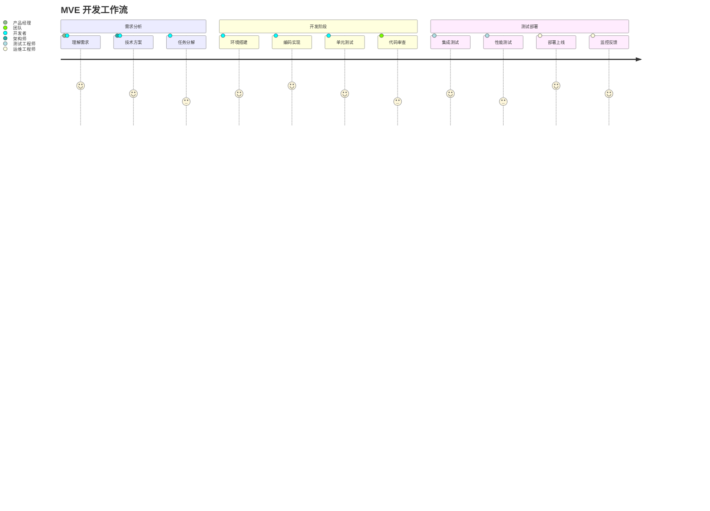

# MVE 架构与知识图表

## 整体架构图



## 响应式系统架构

```d2
direction: right

core: {
  label: "MVE Core 响应式系统"

  signal: {
    label: "Signal"
    shape: cylinder
    style.fill: "#ff6b6b"
  }

  context: {
    label: "Context"
    shape: cylinder
    style.fill: "#4ecdc4"
  }

  effect: {
    label: "Effect"
    shape: cylinder
    style.fill: "#45b7d1"
  }

  hooks: {
    label: "Hooks"
    shape: rectangle
    style.fill: "#96ceb4"
  }
}

dom: {
  label: "DOM 层"

  fdom: {
    label: "fdom"
    shape: rectangle
    style.fill: "#feca57"
  }

  render: {
    label: "Render Functions"
    shape: rectangle
    style.fill: "#ff9ff3"
  }
}

app: {
  label: "应用层"

  components: {
    label: "Components"
    shape: rectangle
    style.fill: "#54a0ff"
  }

  pages: {
    label: "Pages"
    shape: rectangle
    style.fill: "#5f27cd"
  }
}

core.signal -> dom.fdom: "数据绑定"
core.context -> dom.fdom: "上下文传递"
core.effect -> dom.render: "副作用处理"
core.hooks -> app.components: "生命周期"
dom.fdom -> app.components: "DOM 创建"
dom.render -> app.pages: "页面渲染"
```

## 组件生命周期



## 路由系统流程



## 动画系统架构



## 数据流图



## 性能优化策略



## 组件通信模式

```d2
direction: down

parent: {
  label: "父组件"
  shape: rectangle
  style.fill: "#ff6b6b"
}

child1: {
  label: "子组件 A"
  shape: rectangle
  style.fill: "#4ecdc4"
}

child2: {
  label: "子组件 B"
  shape: rectangle
  style.fill: "#45b7d1"
}

context: {
  label: "Context"
  shape: cylinder
  style.fill: "#96ceb4"
}

signal: {
  label: "Signal"
  shape: cylinder
  style.fill: "#feca57"
}

parent -> child1: "Props 传递"
parent -> child2: "Props 传递"
child1 -> parent: "事件回调"
child2 -> parent: "事件回调"

context -> parent: "provide"
context -> child1: "consume"
context -> child2: "consume"

signal -> parent: "订阅"
signal -> child1: "订阅"
signal -> child2: "订阅"
```

## 状态管理模式



## 构建流程

```mermaid
gitgraph
    commit id: "开发环境"
    branch feature
    checkout feature
    commit id: "功能开发"
    commit id: "单元测试"
    checkout main
    merge feature
    commit id: "集成测试"
    branch release
    checkout release
    commit id: "构建优化"
    commit id: "性能测试"
    checkout main
    merge release
    commit id: "生产部署"
```

## 错误处理流程



## 测试策略

```d2
direction: right

testing: {
  label: "MVE 测试策略"

  unit: {
    label: "单元测试"
    shape: rectangle
    style.fill: "#ff6b6b"

    signal_test: "Signal 测试"
    context_test: "Context 测试"
    hook_test: "Hook 测试"
  }

  integration: {
    label: "集成测试"
    shape: rectangle
    style.fill: "#4ecdc4"

    component_test: "组件测试"
    router_test: "路由测试"
    animation_test: "动画测试"
  }

  e2e: {
    label: "端到端测试"
    shape: rectangle
    style.fill: "#45b7d1"

    user_flow: "用户流程"
    performance: "性能测试"
    accessibility: "无障碍测试"
  }
}

tools: {
  label: "测试工具"

  vitest: {
    label: "Vitest"
    shape: cylinder
    style.fill: "#96ceb4"
  }

  playwright: {
    label: "Playwright"
    shape: cylinder
    style.fill: "#feca57"
  }

  lighthouse: {
    label: "Lighthouse"
    shape: cylinder
    style.fill: "#ff9ff3"
  }
}

testing.unit -> tools.vitest
testing.integration -> tools.vitest
testing.e2e -> tools.playwright
testing.e2e -> tools.lighthouse
```

## 部署架构



## 开发工作流



这个图表文档涵盖了 MVE 的各个方面：

1. **整体架构** - 展示 MVE 生态系统的层次结构
2. **响应式系统** - 核心的 Signal/Context/Effect 架构
3. **组件生命周期** - 组件从创建到销毁的完整流程
4. **路由系统** - 基于目录的路由匹配和渲染流程
5. **动画系统** - 视图切换和 CSS 过渡动画架构
6. **数据流** - 数据在各层之间的流动
7. **性能优化** - 各个层面的优化策略
8. **组件通信** - 不同的组件间通信模式
9. **状态管理** - 应用状态的变化流程
10. **构建流程** - 从开发到部署的完整流程
11. **错误处理** - 各种错误情况的处理策略
12. **测试策略** - 完整的测试体系
13. **部署架构** - 生产环境的部署结构
14. **开发工作流** - 团队协作的完整流程

这些图表使用了多种图表类型（Mermaid、D2、PlantUML、C4），能够从不同角度全面展示 MVE 框架的知识体系。
